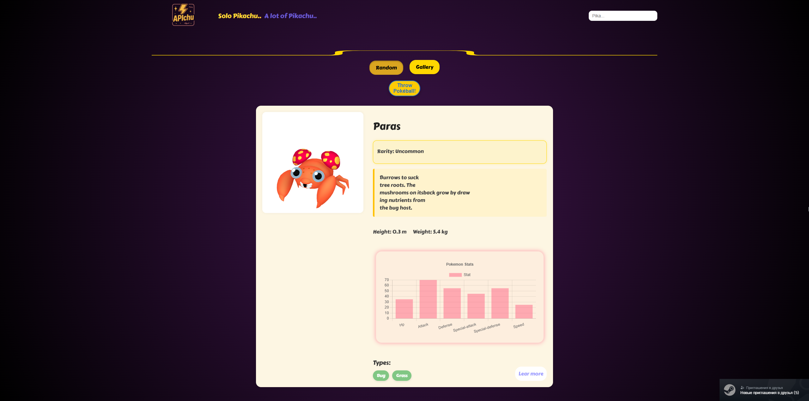
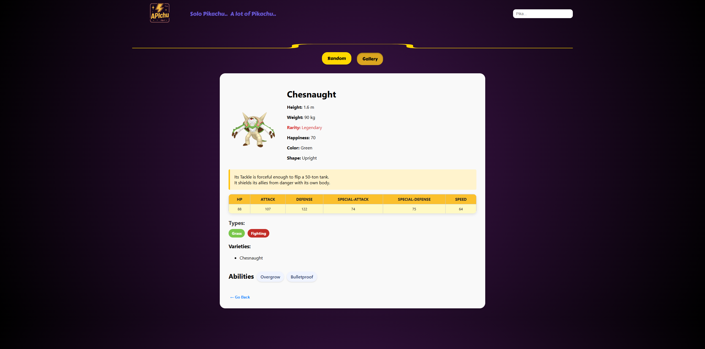

# Apichu 🧩

A simple React application that interacts with the [PokeAPI](https://pokeapi.co/) to fetch and display Pokémon data.  
Built as a training project to improve React skills and API integration.

---

## 🚀 Features

- 🔍 Search and filter Pokémon by name  
- 📦 Fetch data from PokeAPI using the Fetch API  
- 🧩 Modular and reusable React components  
- 🎨 Custom CSS styling (without Tailwind)  
- 🔄 Dynamic data fetching and rendering  

---

## 🛠️ Technologies Used

- React (with Vite)  
- JavaScript (ES6+)  
- Fetch API  
- CSS3  
- [PokeAPI](https://pokeapi.co/)  

---

## 📷 Screenshots




---

## 💻 Installation & Setup

To run this project locally, follow these steps:

```bash
# Clone the repository
git clone https://github.com/xitrenkiy/apichu-react-app.git

# Navigate into the project directory
cd apichu-react-app

# Install dependencies
npm install

# Start the development server
npm run dev

Open your browser and go to http://localhost:5173 to see the app in action.
```

---

## 🌐 Live Demo

[APIchu app](https://apichu.vercel.app/)

---

## 🤝 Contributing

Contributions are always welcome!  
Feel free to:

- Submit pull requests for bug fixes or features  
- Open issues to report bugs or request features  
- Suggest improvements  

Please make sure to update tests as appropriate.

---

## 📄 License

This project is licensed under the MIT License.

---

## 📬 Contact

Created by xitrenkiy  
Feel free to reach out for questions or collaborations!

---

## 📝 Notes

❌ No Tailwind CSS used — all styling is handcrafted with plain CSS

✅ Clean and readable code with reusable components

🎯 Great starter project for React beginners